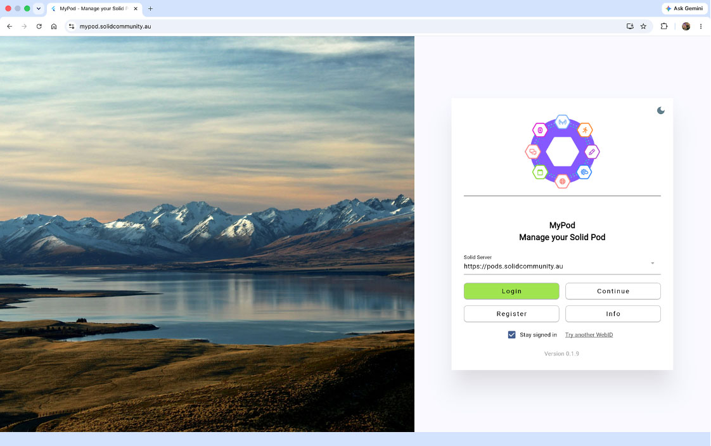
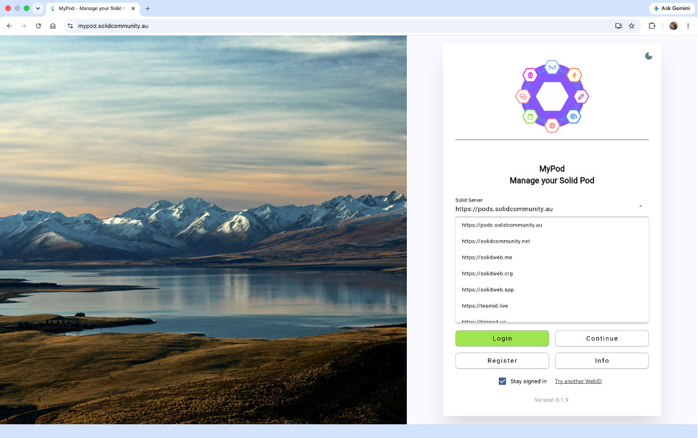
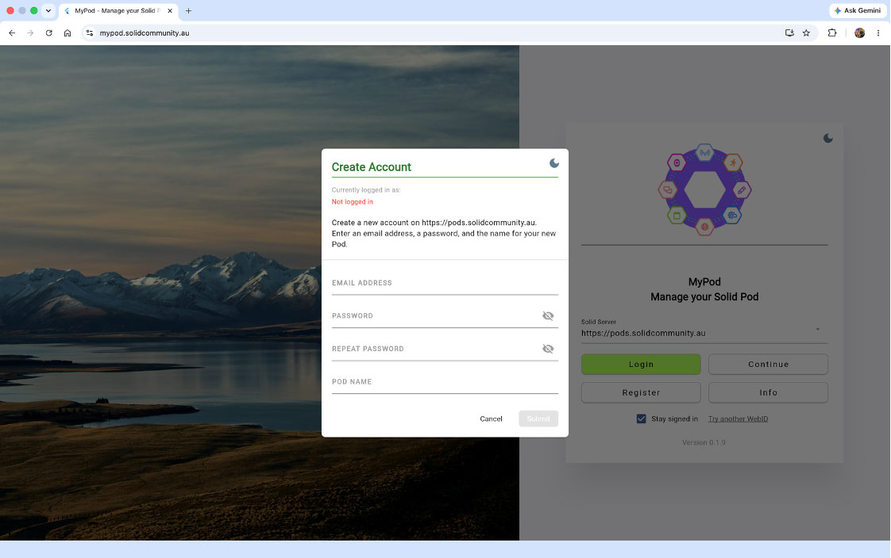
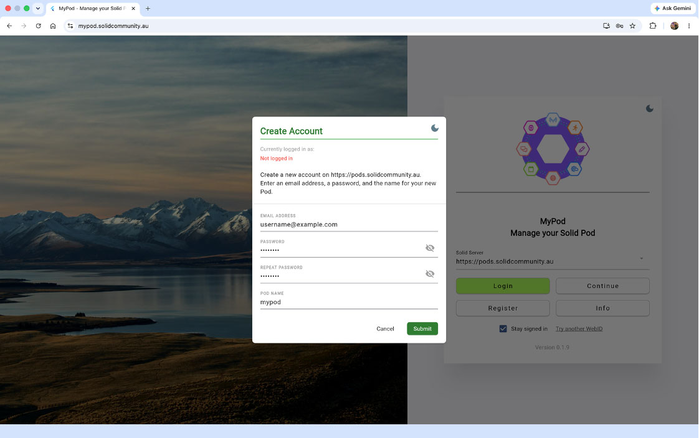
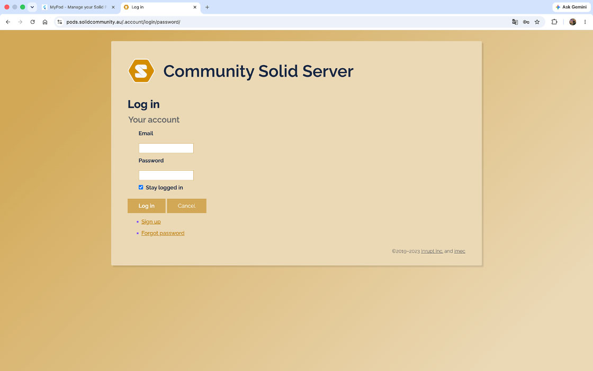
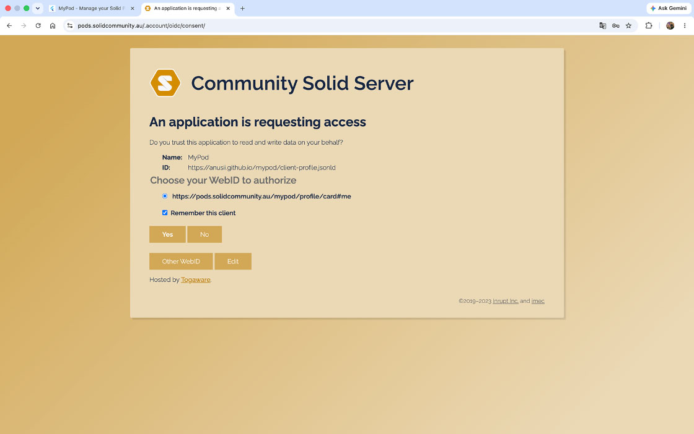
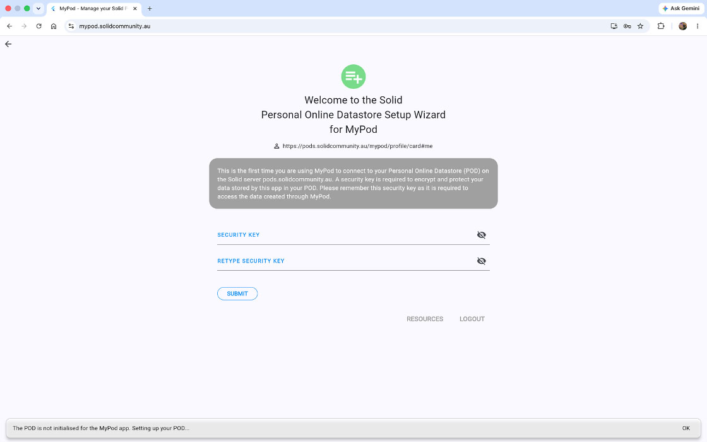
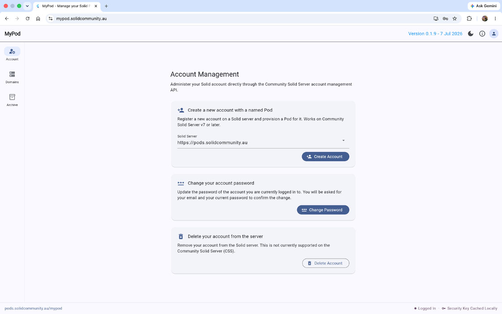

# Exercise 1: Get a POD and login to MyPod app

**Table of Contents**

- [Exercise 1: Get a POD and login to MyPod app](#exercise-1-get-a-pod-and-login-to-MyPod-app)
  - [Setup](#setup)
  - [Get a POD](#get-a-pod)
  - [Login and set security key](#login-and-set-security-key)

This exercise will show you how to create a POD on the solid server hosts 
https://pods.d01.solidcommunity.au/ to https://pods.d04.solidcommunity.au/ 
and how to use the MyPod app to create a POD.

## Setup<a name="setup"></a>

**Option 1:** Open the MyPod app using the web app or download links for the
binary for your OS:

- [MyPod web app](https://mypod.solidcommunity.au/)

Using Flutter framework, we can build apps for multiple platforms with a single
codebase.

Go to [Downloads](https://solidcommunity.au/installers/) to get the MyPod app
binaries for your platform:

- mypod-linux.zip (Linux)
- mypod_amd64.deb (Linux)
- mypod-macos.dmg (macOS)
- mypod-macos.zip (macOS)
- mypod-windows-inno.exe (Windows)
- mypod-windows.zip (Windows)

**Option 2:** If you already have `flutter` installed and setup to build to
`chrome` or desired platform (Linux, MacOS, Windows, Android, iOS), you may
build and run the MyPod app locally on your machine.

```
flutter devices
flutter run -d [your platform]
```

## Get a POD<a name="get-a-pod"></a>

The MyPod app requires you to have a POD hosted on any solid server, which is
identified on the internet with a webID comprising the unique resource
identifier (URI) of your POD. We have setup several solid servers for the 
Solid AU Community for experimenting with Solid. You can use these solid 
servers to get a POD if you don't have one on any Solid server.

Open [MyPod app](https://mypod.solidcommunity.au/).



In the Server input box, you can either enter the server’s URL, or you’d like
to select one of the commonly used servers from the dropdown menu. Here, we 
recommend using one of the ANU SII–managed servers.



Next, click the **Register** button. An account creation form will then pop up.



Enter your email address and password, give your POD a name here. Then 
click Submit button. Your account and your POD will be created. Please note
that the password must be at least 8 characters long.



## Login and set security key<a name="login-and-set-security-key"></a>

The MyPod app stores your files in encrypted form. To do this, you must 
create a password to use as the security key for encrypting your POD files.
The first time you log into the MyPod app, you need to set the security key 
for encryption. Your files are only decrypted in the app. Each time you
subsequently log in, you will need to provide the security key after app 
login to see your files.

Open [MyPod app](https://mypod.solidcommunity.au/) and click `Login`.

This may show you a Community Solid Server login pop up if you are not already
logged in to your POD on the server.



If you have recently logged in to your POD on this Solid servier, you will see
a Community Solid Server authorisation pop up with the last credentials 
which you've used on the Solid Community AU host. Select the POD you want to 
log into, and then click **Yes**.



This will take you to the initial Setup Wizard to finish setting up your POD.
This shows the resources (files) being created in your POD on the Solid
Community AU solid server, and ask you to set a security key which will be used
to encrypt the notes on your POD.



Enter a new password to use as your security key for this POD, then click 
**Submit**.

You are now set up and logged in the MyPod app.



Repeat login to the MyPod app will typically remember your POD webID in the 
Authorise window.
